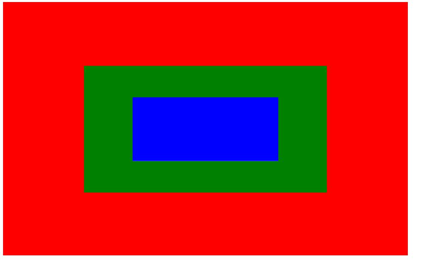
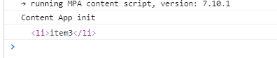

# 浏览器事件机制

## 事件执行过程

W3C指定的DOM2标准中，一次事件的完整过程依次包括 ***捕获阶段*** ， ***目标处理函数执行阶段*** 和 ***事件冒泡阶段*** 三个阶段。

### 捕获阶段

某个元素`target`点击触发了某个事件`event`  ，则在顶层对象`document` 会发出一个*事件流* ，事件流顺着DOM树，从根节点依次往下，向触发事件的目标节点`target` 传递，直到达到了目标节点`target` ，就结束了当前阶段，进入到 *目标处理函数执行阶段*。

在*事件捕获阶段* ，每次经过一个节点，会检查该节点是否在***捕获阶段*** 绑定了同名事件`event` ，有的话就会执行对应的回调函数，然后执行完继续向下传递。

### 目标处理函数执行阶段

在经过 *捕获阶段* ，事件流传递到了目标节点上，浏览器执行绑定在目标节点上的对应的事件处理函数`callback` ， 执行完成后便结束了当前阶段，进入到*事件冒泡阶段*

### 事件冒泡阶段

在经过了 *目标处理函数执行阶段* 后，事件流进行到 *事件冒泡阶段* ，事件流从目标节点`target` 位置开始，一层一层沿着DOM树，往上向顶层对象`document` 进行冒泡。

冒泡阶段，每次经过一个节点，会检查节点是否有在***冒泡阶段*** 绑定同名事件`event` ，如果有的话，就执行这个事件对应的回调函数，执行完以后，继续往上进行冒泡。

### 阻止冒泡

在某个节点内，可以在其回调函数的参数`callback(e)` 中，调用事件对象`e` 的`e.stopPropagation` 或是 `e.cancelBubble`方法，阻止事件继续向上冒泡。

阻止了事件向上冒泡后，事件流就会停止向上传递了。


## 事件注册

### addEventListener

```js
target.addEventListener(event, listener, options);
target.addEventListener(event, listener, useCapture);
```

- *type* 要注册的事件
- *listener* 事件监听器回调函数，接收一个事件参数
- *options*
  - *capture* 是否将事件注册在 **捕获阶段** ， `true` 表示注册在捕获阶段
  - *once* 表示 `listener` 在添加之后最多只调用**一次**。如果是 `true` ,`listener` 会在其被调用之后自动移除。
- *useCapture* 是否将事件注册到**捕获阶段**

### removeEventListener

```js
target.removeEventListener(type, listener[, options]);
target.removeEventListener(type, listener[, useCapture]);
```

### 参考

- [MDN-addEventListener](https://developer.mozilla.org/zh-CN/docs/Web/API/EventTarget/addEventListener)
- [MDN-removeEventListener](https://developer.mozilla.org/zh-CN/docs/Web/API/EventTarget/removeEventListener)

## example

我们先写一个简单的HTML用于测试

```html
<!DOCTYPE html>
<html lang="en">

<head>
  <meta charset="UTF-8">
  <meta name="viewport" content="width=device-width, initial-scale=1.0">
  <title>Document</title>
  <style>
   #div1 {
      width: 800px;
      height: 500px;
      background-color: red;
      display: flex;
      justify-content: center;
      align-items: center;
    }

    #div2 {
      width: 60%;
      height: 50%;
      background-color: green;
      display: flex;
      justify-content: center;
      align-items: center;

    }

    #div3 {
      width: 60%;
      height: 50%;
      background-color: blue;
    }
  </style>
</head>

<body>
  <div id="div1">
    <div class="" id="div2">
      <div id="div3"></div>
    </div>
  </div>

</body>
</html>
```



#### 冒泡阶段

然后给三个`div` 注册上事件，事件注册在冒泡阶段。

基于上面的描述，我们可以分析得到，三个事件都是在*冒泡阶段*，我们点击最内层的节点（下面的例子，没有特殊说明，点击的都是最内层节点），事件正确的触发顺序应该是 *div3 -> div2 -> div1* 

```html
<script>
  const divs = document.querySelectorAll('div')
  function baseFun(e) {
    console.log(this['id'], 'baseFunction')
  }
  function stopFun(e) {
    console.log(this['id'], 'stopFunction')
    e.stopPropagation()
    e.cancelBubble = true
  }
  divs[0].addEventListener('click', baseFun, false)
  divs[1].addEventListener('click', baseFun, false)
  divs[2].addEventListener('click', baseFun, false)
</script>
```

控制台得到的输出（控制台上，越早输出的信息在越上面）

```
div3 baseFunction
div2 baseFunction
div1 baseFunction
```

#### 捕获阶段

如果我们把事件都注册到*捕获阶段* ，则事件触发应该是 *div1->div2 -> div3*

```html
<script>
  const divs = document.querySelectorAll('div')
  function baseFun(e) {
    console.log(this['id'], 'baseFunction')
  }
  function stopFun(e) {
    console.log(this['id'], 'stopFunction')
    e.stopPropagation()
    e.cancelBubble = true
  }
  divs[0].addEventListener('click', baseFun, true)
  divs[1].addEventListener('click', baseFun, true)
  divs[2].addEventListener('click', baseFun, true)
</script>
```

```
div1 baseFunction
div2 baseFunction
div3 baseFunction
```

#### 阻止冒泡

我们同时在捕获阶段和冒泡阶段都注册事件，同时，在第二个节点上阻止冒泡。

```html
<script>
  const divs = document.querySelectorAll('div')
  function baseFun(e) {
    console.log(this['id'], 'baseFunction')
  }
  function stopFun(e) {
    console.log(this['id'], 'stopFunction')
    e.stopPropagation()
    e.cancelBubble = true
  }

  divs[0].addEventListener('click', baseFun, true)
  divs[1].addEventListener('click', baseFun, true)
  divs[2].addEventListener('click', baseFun, true)

  divs[0].addEventListener('click', baseFun, false)
  divs[1].addEventListener('click', stopFun, false)
  divs[2].addEventListener('click', baseFun, false)
</script>
```

按照分析的话，正确的输出应该是在*捕获阶段* ，依次触发 *div1 -> div2 -> div3* ，然后在*冒泡阶段* 依次触发 *div3 -> div2* ,在 *div2* 处就停止冒泡

```
div1 baseFunction
div2 baseFunction
div3 baseFunction
div3 baseFunction
div2 stopFunction
```

#### 在捕获阶段阻止冒泡

如果将阻止冒泡的函数放到*捕获阶段* ， 则事件将会停止往下传递，事件流也会停止。

也就是说`stopPropagation` ，不仅仅可以阻止事件冒泡，还可以阻止事件捕获。

```html
<script>
  const divs = document.querySelectorAll('div')
  function baseFun(e) {
    console.log(this['id'], 'baseFunction')
  }
  function stopFun(e) {
    console.log(this['id'], 'stopFunction')
    e.stopPropagation()
    e.cancelBubble = true
  }

  divs[0].addEventListener('click', baseFun, true)
  divs[1].addEventListener('click', stopFun, true)
  divs[2].addEventListener('click', baseFun, true)

  divs[0].addEventListener('click', baseFun, false)
  divs[1].addEventListener('click', baseFun, false)
  divs[2].addEventListener('click', baseFun, false)
</script>
```

按照分析，事件流应该是 *div1 -> div2* ,然后在*捕获阶段* 就停止

```
div1 baseFunction
div2 stopFunction
```

## 事件委托（代理）

在一些场景，一个父节点下的多个子节点，都需要注册同一个事件。

基本的方法，可以遍历这些子节点，然后逐个在这些子节点上注册事件。但是在一些异步加载，动态添加子节点的情况下，可能就会使得一些后面添加进来的子节点，没有注册到事件。

同时，在每个子节点上注册事件，对于事件的销毁也变得麻烦。

事件委托，则是把子节点上的事件，放到父节点上进行代理，让子节点的事件冒泡到父节点上，而不是给每一个子节点都注册事件。

通过`e.target` 来获取到触发事件的目标节点

```html
<!DOCTYPE html>
<html lang="en">

<head>
  <meta charset="UTF-8">
  <meta name="viewport" content="width=device-width, initial-scale=1.0">
  <title>Document</title>
</head>

<body>
  <ul id="ul">
    <li>item1</li>
    <li>item2</li>
    <li>item3</li>
    <li>item4</li>
    <li>item5</li>
    <li>item6</li>
    <li>item7</li>
  </ul>

</body>
<script>
  const ul = document.querySelector('#ul')
  ul.addEventListener('click', (e) => {
    console.log(e.target)
  }, false)
</script>

</html>
```

点击 *item3* ，控制台打印得到

