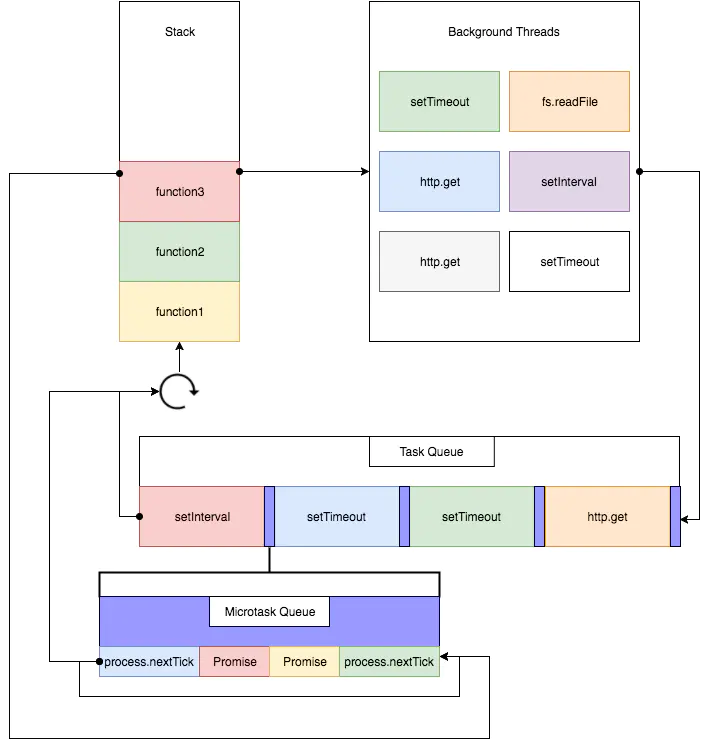
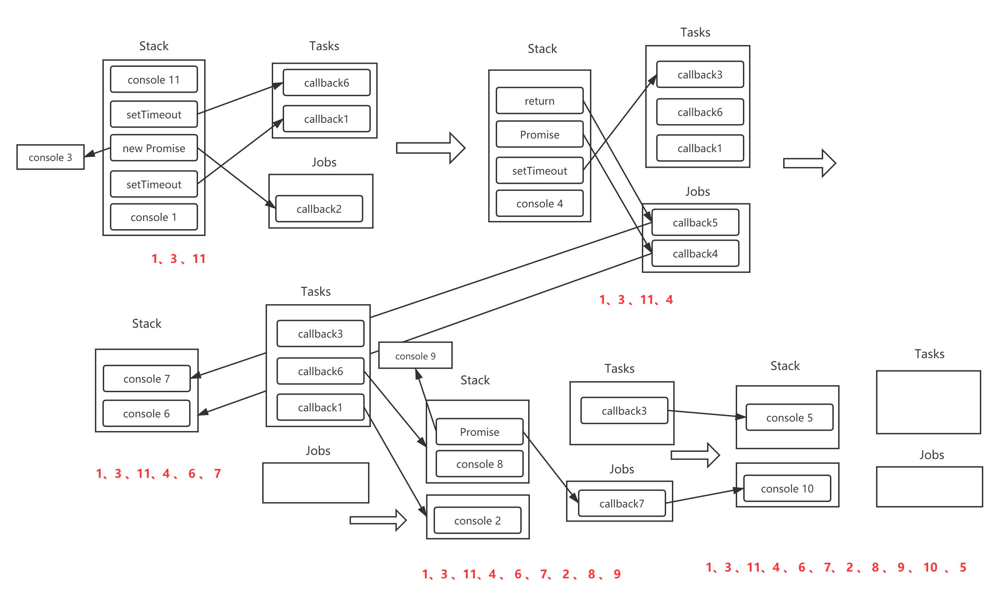

# JavaScript EventLoop

## Event loop 

*event loop* 是一个事件的执行模型，用来处理JavaScript中的异步进程。

### 宏队列

宏队列 *macro task queue* ，也即 *tasks* ，宏队列中的异步任务的回调函数依次进入 *macro task queue* ，等待后续被调用

- setTimeout
- setInterval
- setImmediate `nodejs`
- requestAnimationFrame `browser`
- I/O
- UI rendering `browser`


### 微队列

微队列 *micro task queue* ，也即 *jobs*， 微队列中的异步任务的回调依次进入 *micro task queue* ， 等待后续被调用

- process.nextTick `nodejs`
- Promise
- Object.observe
- MutationObserver

### 注意事项

要注意到的是，不算是微队列还是宏队列，都是 ***回调函数*** 进入队列，而不是这些语句进入队列。

例如下面的语句：

```js
new Promise(resolve => {
  console.log(1)
  resolve(2)
}).then(res => {
  console.log(res)
})
```

回调函数是`then` 语句部分，而不是`Promise` 接收的函数参数，因此进入微队列的是`then`回调函数，`Promise` 部分是一个同步语句，会按顺序进入调用栈

同样对于下面 `setTimeout` 语句：

```js
setTimeout(()=>{
  console.log(1)
},0)
```

回调函数是`()=>console.log(1)`，会进入到*宏队列*， 而不是`setTimeout` 这一条语句


## 浏览器 Event Loop

### 模型

1. 执行全局同步代码，包括同步语句和异步语句
2. 全局代码执行完毕后，调用栈被清空
3. 从微队列中取出队首的回调函数，放入调用栈中执行（开始一次微队列清空的周期）
4. 如果此时微队列中还有其他任务，继续取出位于队首的回调函数，放入到调用栈中执行，直到把微队列中的所有任务执行完毕（完成了一次微队列清空的周期）。微队列执行过程中产生的其他 `jobs` ，会加入到微队列末尾等待执行（在同一次微队列清空周期中执行），而产生的 `tasks` 则会进入到宏队列末尾，等待执行。
5. 微队列的任务全部执行完毕后，调用栈为空，开始取出宏队列中位于队首的任务，放入到调用栈中执行。宏队列执行过程中产生的`jobs` 和 `tasks` 会一次进入到对应的队列中等待。
6. 宏队列中取出的任务执行完毕后，调用栈为空。此时再去微队列中，做一次微队列清空。
7. 重复 *3--6* ，一直到微队列、宏队列的任务都执行完。



### 关键点

- 全局代码执行完后，先去执行 *微队列*，做一次*微队列清空*
- 微队列清空后，取一个宏队列的任务来执行。
- 每次执行完一个宏队列后，先看看微队列是否有任务在等待执行，有的话就做一次微队列的清空，没有的话再去执行下一个宏队列中的任务
- *UI rendering* 的执行时在做了 *微队列清空* 之后，在下一个宏队列的任务执行之前这个时间段执行。

### Examples

```js
console.log(1)

setTimeout(() => console.log(2), 0)

new Promise(resolve => {
  console.log(3)
  resolve(4)
})
  .then(res => {
    console.log(res)
    setTimeout(() => console.log(5), 0)
    Promise
      .resolve()
      .then(res => {
        console.log(6)
      })
    return 7;
  })
  .then(res => console.log(res))

setTimeout(() => {
  console.log(8)
  new Promise(resolve => {
    console.log(9)
    resolve(10)
  })
    .then(res => console.log(res))
}, 0)

console.log(11)
```

上面例子的正确输出是 `1 3 11 4 6 7 2 8 9 10 5`

具体执行过程可以用下面的图来解释

*我好后悔写了个这么复杂的例子*



## 参考

- [掘金-带你彻底弄懂Event Loop](https://juejin.im/post/5b8f76675188255c7c653811)

