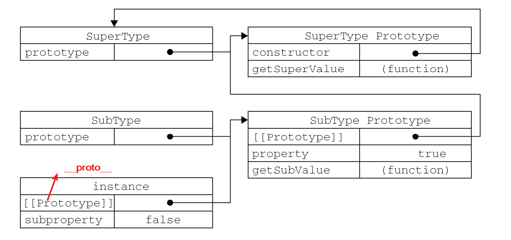

# Javascript Extend

## 原型继承

### 原型链

每个*构造函数 Constructor* 都有一个 *原型对象 prototype* ，原型对象都包括一个指向了*构造函数* 的指针，而每个*实例* 都包含了一个指向原型对象的内部指针*__ proto __*。

当一个*原型对象* 恰好是另外一个类型的*实例* ，则此时*原型对象* 将包含一个指针指向了另外一个*原型对象* ，另一个原型对象也包含着一个指向了另外一个*构造函数* 的指针。

### 实现

```js
function SuperType() {
  this.value = 1;
  this.data = [1, 2, 3]
}
SuperType.prototype.getValue = function () {
  return this.value;
}
SuperType.prototype.getData = function () {
  return this.data;
}

function SubType() {
  this.subValue = 2;
}
SubType.prototype = new SuperType();
SubType.prototype.getSubValue = function () {
  return this.subValue;
}

const instance = new SubType();
console.log(instance.getValue()) // 1
console.log(instance.__proto__ === SubType.prototype) // true
console.log(instance.__proto__.__proto__ === SuperType.prototype) // true
```

上面例子中`SubType` 通过原型链继承了`SuperType` ，`SubType` 的原型对象 `SubType.prototype` 是 `SuperType` 的一个实例，则`SubType.prototype.__proto__ === SuperType.prototype`

而`instance` 是 `SubType` 的一个实例，`instance.__proto__ === SubType.prototype` 

因此有 `instance.__proto__.__proto__ === SuperType.prototype` 这样的一个原型关系。



```js
console.log(instance instanceof SubType) // true
console.log(instance instanceof SuperType) // true
console.log(instance instanceof Object) // true
```

应该注意到，函数的原型对象是`Object` ，因此在原型链上，`Object` 也是`instance` 这个实例的原型

### 注意

#### 引用类型的实例属性

包含*引用类型值*的**原型属性**会被所有实例共享，在通过原型链进行继承时，原型对象A继承自原型B，即原型A是原型B的构造函数的实例，

因此原型B的实例的实例属性就变成原型A的原型属性了，对于原型B中的引用类型的属性，在原型A中就会被其所有实例共享，一个实例修改以后，会影响其他实例。

```js
const instance2 = new SubType()
console.log(instance2.data) // [1,2,3]
instance.data.push(4)
console.log(instance2.data) // [1,2,3,4]
```

在上面例子中，对第一个创建的`SubType` 实例`instance` 的原型属性 `instance.data` 进行修改，会影响到创建的第二个实例`instance2` 上的对应属性

#### 创建子类型时，不能向继承的父类的构造函数传递参数

上面的例子中，如果继承的父类`SuperType` 构造函数接收一些参数，而子类型`SubType` 只是父类的一个实例，在创建父类的实例然后赋值给子类的原型对象后，子类的原型对象的实例属性就固定了，子类创建的所有实例，都会有这个相同的属性，而不能传递不同的参数给父类构造函数来创建不同的子类实例。


```js
function SuperType(color) {
  this.value = 1;
  this.data = [1, 2, 3]
  this.color = color;
}
SuperType.prototype.getValue = function () {
  return this.value;
}
SuperType.prototype.getData = function () {
  return this.data;
}

function SubType() {
  this.subValue = 2;
}
SubType.prototype = new SuperType('red');
```

上面代码，`SubType` 的所有实例的`color`属性，都会是*red* 

## 构造函数继承

通过在子类的构造函数中去调用父类的构造函数，同时指定函数执行的上下文为子类的上下文。

构造函数方式实现继承，只是子类借用了父类的构造函数，继承了构造函数上的属性和方法，而不是继承了父类构造函数原型对象上的原型方法、属性。

```js
function SuperType(color) {
  this.value = 1;
  this.data = [1, 2, 3]
  this.color = color;
  this.getData = function () {
    return this.data;
  }
}
SuperType.prototype.getValue = function () {
  return this.value;
}
SuperType.prototype.age = 18;

function SubType(color) {
  SuperType.call(this, color)
  this.subValue = 2;
}

const instance = new SubType('red');

// console.log(instance.getValue()) // error!
console.log(instance.getData()) // [1,2,3]
console.log(instance.age) // undefined
```

当然，通过这种方式，可以避免原型链继承上的两个缺陷：*引用类型属性共享* 和 *不能给父类构造函数传递参数*

```js
const instance = new SubType('red');

// console.log(instance.getValue()) // error!
console.log(instance.getData()) // [1,2,3]
console.log(instance.age) // undefined

console.log(instance.__proto__ === SubType.prototype) // true
console.log(instance.__proto__.__proto__ === SuperType.prototype) // false

console.log(instance instanceof SubType) // true
console.log(instance instanceof SuperType) // false
console.log(instance instanceof Object) // true

const instance2 = new SubType('white')
console.log(instance2.data) // [1,2,3]
instance.data.push(4)
console.log(instance2.data) // [1,2,3]

console.log(instance.color, instance2.color) // red , white
```

## 组合继承

组合继承通过组合 *原型链继承*  与 *构造函数继承* 两种方式，实现互相弥补。

子类的构造函数内，调用父类的构造函数，同时，子类的原型对象，是父类构造函数的一个实例。

关键的一步是，在给子类原型对象赋值了父类构造函数的实例后，再把子类原型对象的`constructor` 指针，指向到子类的构造函数上，实现构造函数继承的方式。

```js
function SuperType(color) {
  this.value = 1;
  this.data = [1, 2, 3]
  this.color = color;
}
SuperType.prototype.getValue = function () {
  return this.value;
}
SuperType.prototype.getData = function () {
  return this.data;
}
SuperType.prototype.age = 18;

function SubType(color) {
  SuperType.call(this,color)
  this.subValue = 2;
}
SubType.prototype = new SuperType();
SubType.prototype.constructor = SubType;

SubType.prototype.getSubValue = function () {
  return this.subValue;
}
```

通过组合继承的方法，解决了原型链继承的两个缺陷，同时也解决了构造函数继承中不能继承父类原型属性的限制。

```js
const instance = new SubType('red');

console.log(instance.getValue()) // 1
console.log(instance.getData()) // [1,2,3]
console.log(instance.age) // 18

console.log(instance.__proto__ === SubType.prototype) // true
console.log(instance.__proto__.__proto__ === SuperType.prototype) // true

console.log(instance instanceof SubType) // true
console.log(instance instanceof SuperType) // true
console.log(instance instanceof Object) // true

const instance2 = new SubType('white')
console.log(instance2.data) // [1,2,3]
instance.data.push(4)
console.log(instance2.data) // [1,2,3]

console.log(instance.color, instance2.color) // red , white
```

### 缺陷

组合继承最大的 问题就是无论什么情况下，都会调用**两次**父类的构造函数：一次是在创建子类型原型的时候，另一次是 在子类型构造函数内部。

两次调用父类构造函数的结果是，会创建两组的同名属性。

在第一次调用父类构造函数，即创建子类原型对象的时候，创建了一个父类构造函数的实例 `ins` ，在`ins` 内部具有父类的实例属性*value , data , color*，然后`ins` 赋值给了子类原型对象，因此在子类原型对象上有这些实例属性。

在第二次调用父类构造函数时，即在调用子类构造函数创建实例`instance` 时候，此时创建的实例`instance` 会继承了构造函数中定义的属性，也就是父类构造函数的实例属性 *value, data , color* ，子类实例属性上就会有和子类原型对象同名的*value,data,color* 属性，实例属性会把子类原型对象的属性覆盖掉。

## 原型式继承

原型是继承，通过一个函数，接收一个原型对象作为参数。

在函数内部，先创建了一个临时性的构造函数，然后将传入的对象作为这个构造函数的 原型，最后返回了这个临时类型的一个新实例

```js
function extend(proto) {
  function Ctor() { };
  Ctor.prototype = proto;
  return new Ctor();
}
```

原型式继承，只是对传入的原型对象做了一次 *浅拷贝* 

这种继承方式，与原型链继承方式有相同的缺陷。对于引用类型的属性，会在所有实例中共享

```js
const Person = {
  name: 'wenjiang',
  skills: ['sleep', 'eat']
}

const james = extend(Person)
console.log(james.name, james.skills) // wenjiang , ['sleep','eat']
james.name = 'handsome-boy'
james.skills.push('cry')

const davis = extend(Person)
console.log(davis.name, davis.skills) // wenjiang , ['sleep','eat','cry']
```

原型式继承于ES6中`Object.create`类似。

`Object.create` 方法第一个参数是实例的原型对象，第二个参数是实例的属性描述符


## 寄生式组合继承

寄生组合继承类似于组合继承的方式，主要区别在于寄生组合继承通过*原型式继承* ，对父类做一个浅拷贝，实现子类继承父类的方法，而**不是**原型链式继承，这样可以**减少一次调用父类的构造函数**。

```js
function extend(subType, superType) {
  const prototype = Object.create(superType.prototype)
  prototype.constructor = subType
  return subType.prototype = prototype;
}
```

在将父类的原型对象浅拷贝到子类的原型对象上的时候，子类的构造函数指针`constructor` 被重写了，因此需要重新修改，指到子类上。

对于前面的例子，我们通过`extend` 函数来实现寄生式的组合继承

```js
function SuperType(color) {
  this.value = 1;
  this.data = [1, 2, 3]
  this.color = color;
}
SuperType.prototype.getValue = function () {
  return this.value;
}
SuperType.prototype.getData = function () {
  return this.data;
}
SuperType.prototype.age = 18;

function SubType(color) {
  SuperType.call(this, color)
  this.subValue = 2;
}

SubType.prototype.getSubValue = function () {
  return this.subValue;
}

extend(SubType, SuperType)
```

此时，子类`SubType` 原型对象上获得了父类的原型对象上的属性和方法，同时子类的构造函数内，*借用* 父类构造函数，来实现对构造函数内部的属性、方法的继承。

```js
const instance = new SubType('red');

console.log(instance.getValue()) // 1
console.log(instance.getData()) // [1,2,3]
console.log(instance.age) // 18

console.log(instance.__proto__ === SubType.prototype) // true
console.log(instance.__proto__.__proto__ === SuperType.prototype) // true

console.log(instance instanceof SubType) // true
console.log(instance instanceof SuperType) // true
console.log(instance instanceof Object) // true

const instance2 = new SubType('white')
console.log(instance2.data) // [1,2,3]
instance.data.push(4)
console.log(instance2.data) // [1,2,3]

console.log(instance.color, instance2.color) // red , white
```


